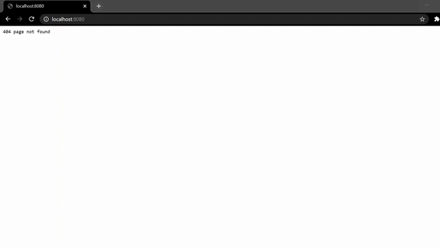

# Blog Web App With Golang

> Web App with a created http server to write and save the text you want 

# Install

### Golang
```bash
go get https://github.com/SoummerELMehdi/Blog_Web_App
# generate and run .exe
go build
./WEB_SERVER
```
## Testing the API 
> i deleted the design part of the web app, now the app works but you will not get the image :(
---

